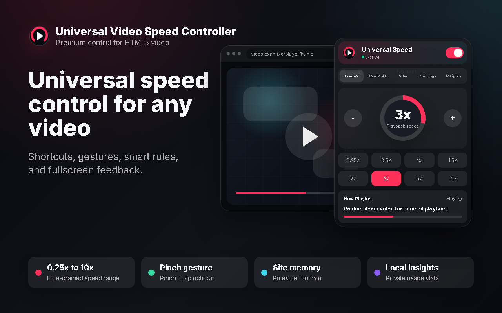
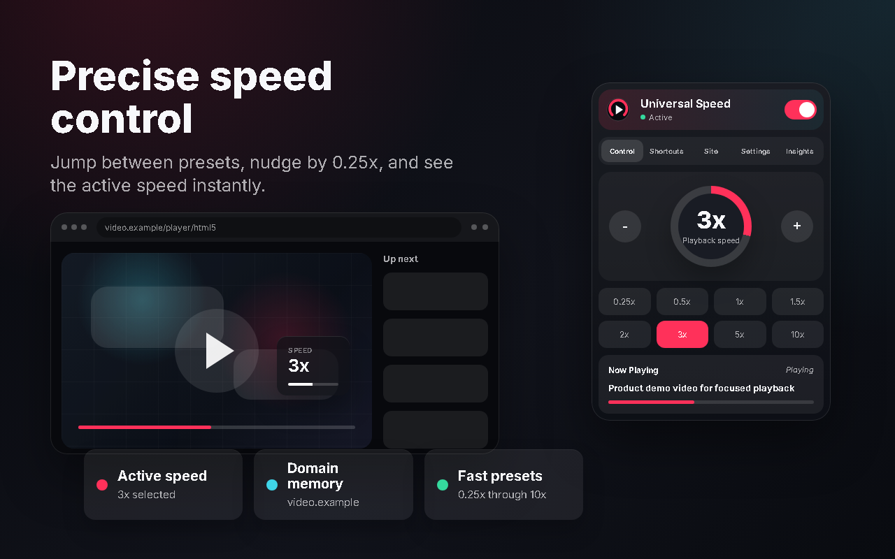
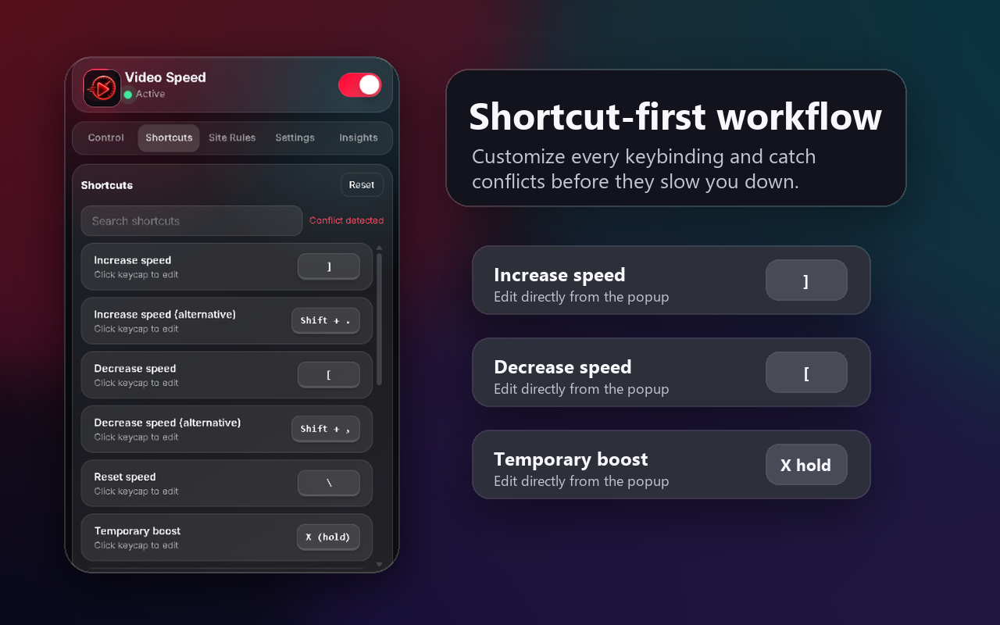
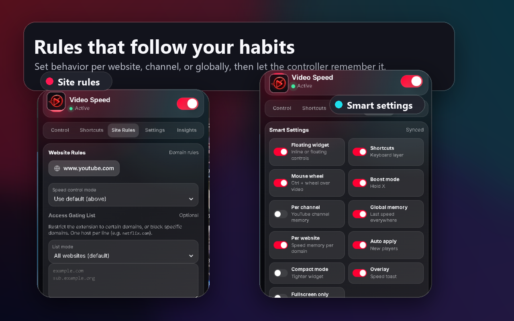
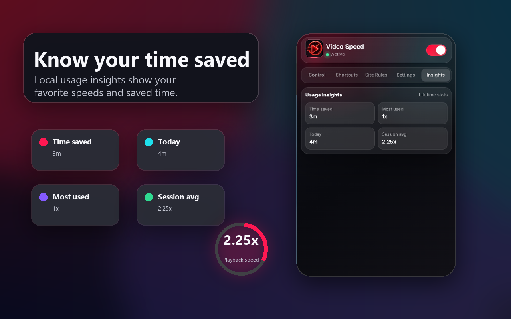
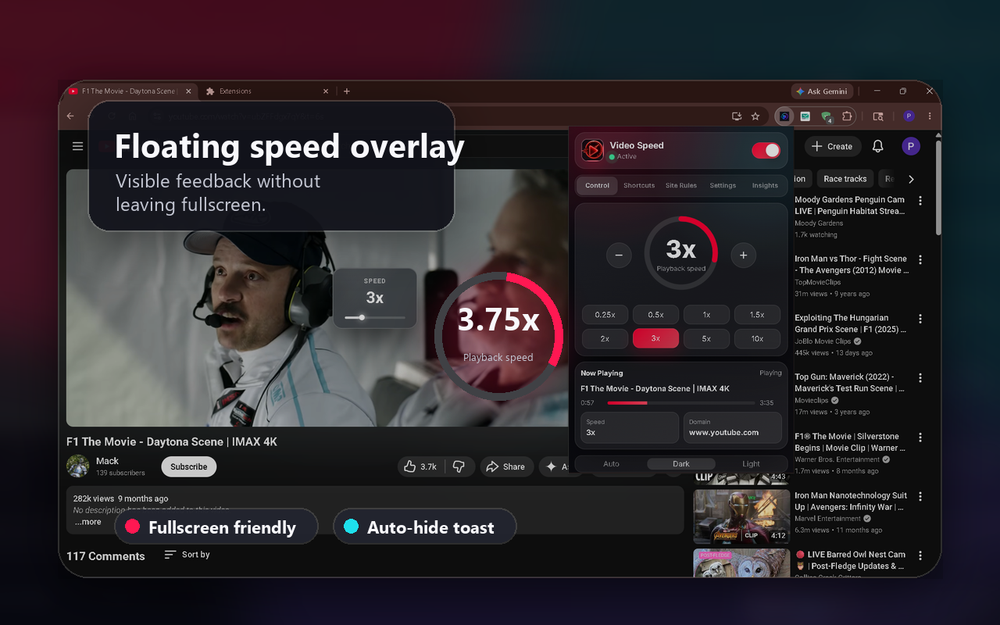

# Universal Video Speed Controller

[](https://chromewebstore.google.com/detail/universal-video-speed-con/gjinmpjidodkbcgooeldokolkgejcfcp)
[](https://addons.mozilla.org/en-US/firefox/addon/universal-video-speed-ctrl/)
[](LICENSE)
[](https://makeapullrequest.com)

A modern, high-performance browser extension for fast, precise HTML5 video playback speed control on any website. 

The extension injects a native-feeling floating speed widget, toolbar popup controls, keyboard shortcuts, mouse scroll gestures, touchpad pinch configurations, per-site default rules, and calculates offline watch time saved analytics.



---

## Features

* **Universal Player Detection**: Seamlessly detects and binds controls to standard HTML5 `<video>` tags on YouTube, Netflix, Vimeo, Coursera, Loom, Twitch, and custom lecture portals.
* **Precise Speed Adjustments**: Adjust playback rate from `0.25x` to `10.0x` in customizable `0.05x` or `0.25x` step increments.
* **Floating Widget**: A lightweight, autohiding `- / speed / +` widget overlaying the active video player. On YouTube, it integrates directly with the control bar.
* **Keyboard Hotkeys**: Fully customizable hotkeys for speed up, slow down, speed reset, widget toggle, and fullscreen HUD toggle.
* **Temporary Boost Mode**: Press and hold `X` to temporarily accelerate video playback (default `2x`); release the key to immediately restore the previous speed.
* **Mouse Scroll & Touchpad Gestures**: Adjust speeds by holding `Ctrl` and scrolling your mouse wheel over the video player, or use pinch-in/pinch-out trackpad gestures.
* **Frosted Fullscreen HUD**: A clean, non-intrusive center toast overlay displaying playback speed values and percentage sliders during fullscreen.
* **Smart Memory Rules**: Save preferred speeds globally, per domain (e.g. YouTube at 1.75x, Netflix at 1.1x), or per YouTube channel.
* **Gated Access**: Set domain configurations to run the extension on all websites, allowed domains only (allowlist), or block specific sites (blocklist).
* **Local Telemetry & Insights**: Tracks total watch time saved, daily usage history, session averages, and your most frequently used speed ranges stored 100% locally.

---

## Store Previews

The promotional assets in `assets/store/` detail the user interface:

| Quick Control Panel | Shortcuts & Gestures |
| --- | --- |
|  |  |

| Rules & Settings Memory | Local Insights & HUD Toast |
| --- | --- |
|  |  |



---

## Default Keyboard Shortcuts

| Shortcut | Action | Details / Behaviors |
| --- | --- | --- |
| `]` or `Shift` + `.` | Increase Speed | Increases speed rate by `0.25x` steps (up to `10.0x`). |
| `[` or `Shift` + `,` | Decrease Speed | Decreases speed rate by `0.25x` steps (down to `0.25x`). |
| `\` | Reset Speed | Instantly restores playback rate back to normal `1.0x`. |
| Hold `X` | Temporary Boost | Speeds up video while pressed; restores rate on key release. |
| `Shift` + `S` | Toggle Widget | Hides or reveals the floating controls widget overlay. |
| `Shift` + `H` | Toggle HUD Toast | Toggles the center fullscreen toast speed notification. |
| `Ctrl` + Mouse Scroll | Scroll Speed | Adjusts playback speed by scrolling over the active player. |
| Trackpad Pinch | Pinch Adjust | Pinch-in/pinch-out trackpad gestures adjust speed rates. |

---

## Project Structure

```
├── manifest.json         # Manifest V3 extension configuration
├── manifest.firefox.json # Firefox-compatible configuration
├── background.js         # Service worker seeding storage defaults
├── constants.js          # Shared hotkey and settings constants
├── content.js            # Injected content script (modular managers)
├── styles.css            # Floating widget and HUD toast overlays styling
├── popup.html            # Extension dashboard markup
├── popup.css             # Extension dashboard styling
├── popup.js              # Dashboard sync controllers and storage persistence
├── docs/                 # Marketing site & SEO landing pages (GitHub Pages)
├── assets/
│   ├── icons/            # Extension icons (16px, 32px, 48px, 128px)
│   └── store/            # Promo banners, screenshots, and visual mockups
└── tests/                # Jest unit test suites
```

---

## Architecture & Technical Decisions

The extension is designed to run cleanly, ensuring zero performance drops:

* **Modular Singleton Orchestrator**: Code in `content.js` is partitioned into separate single-responsibility classes (`SettingsManager`, `DOMObserver`, `VideoController`, `WidgetUI`, `ToastUI`, `ShortcutManager`, `WheelManager`, `AnalyticsManager`) unified under a central `AppController`.
* **High-Performance DOM Traversal**: Instead of periodic deep DOM scanning using CPU-heavy queries (which causes layout thrashing), the script listens to event-driven mutations (`MutationObserver`) and uses tree walkers to skip layout-only nodes. CPU overhead is close to 0%.
* **Zero-Leak Lifecycle & Teardown**: To resolve extension context invalidation errors during reloads, the script registers a global `__youtubeSpeedControllerCleanup` callback. It completely tears down previous handlers, observers, timers, and elements before launching a new instance.
* **Layout Compositing**: Uses hardware-accelerated GPU compositing (`transform: translate3d(0,0,0)`) on primary HUD animations to prevent frame drops.
* **Graceful Degradation**: Core APIs fall back gracefully to defaults if the extension runtime gets invalidated or updated while a tab is open.

---

## Local Development & Installation

If you want to run or test the extension locally:

1. Clone or download this repository to your local drive.
2. Launch Google Chrome.
3. Navigate to `chrome://extensions/`.
4. Enable the **Developer mode** toggle switch in the upper right corner.
5. Click the **Load unpacked** button and select the project folder containing `manifest.json`.
6. Open any tab containing an HTML5 video player to load and test the local build.

---

## Packaging for Web Stores

To submit updates to the Chrome Web Store or Mozilla Add-ons portal, package the extension files into a zip archive. Since Chrome (Manifest V3) and Firefox (Manifest V2) utilize different configurations, follow the appropriate commands for your terminal:

### For Google Chrome (Manifest V3)

Create a zip archive containing the core extension code:

#### Bash (macOS / Linux)
```bash
zip -r universal-video-speed-controller.zip manifest.json background.js constants.js content.js styles.css popup.html popup.css popup.js _locales assets/icons
```

#### PowerShell (Windows)
```powershell
Compress-Archive -Path manifest.json, background.js, constants.js, content.js, styles.css, popup.html, popup.css, popup.js, _locales, assets\icons -DestinationPath universal-video-speed-controller.zip -Force
```

### For Mozilla Firefox (Manifest V2)

To compile for Firefox, copy the Firefox manifest configuration to `manifest.json` before zipping, then restore the original Chrome manifest:

#### Bash (macOS / Linux)
```bash
# Backup Chrome manifest, copy Firefox manifest, zip, and restore Chrome manifest
cp manifest.json manifest.chrome.json
cp manifest.firefox.json manifest.json
zip -r universal-video-speed-controller-firefox.zip manifest.json background.js constants.js content.js styles.css popup.html popup.css popup.js _locales assets/icons
mv manifest.chrome.json manifest.json
```

#### PowerShell (Windows)
```powershell
# Backup Chrome manifest, copy Firefox manifest, zip, and restore Chrome manifest
Copy-Item manifest.json manifest.chrome.json
Copy-Item manifest.firefox.json manifest.json
Compress-Archive -Path manifest.json, background.js, constants.js, content.js, styles.css, popup.html, popup.css, popup.js, _locales, assets\icons -DestinationPath universal-video-speed-controller-firefox.zip -Force
Move-Item -Path manifest.chrome.json -Destination manifest.json -Force
```

---

## Contributing Guide

We welcome contributions from the community! To help maintain code quality and security, please follow these guidelines when submitting pull requests:

### 1. Environment Setup
The extension is built using vanilla HTML, CSS, and JavaScript, meaning there are no compilation build steps. However, you will need Node.js to run local tests and syntactic validations:

```bash
# Clone the repository
git clone https://github.com/danishansari-dev/universal-video-speed-controller.git
cd universal-video-speed-controller

# Install developer dependencies (Jest testing framework)
npm install
```

### 2. Validation & Syntax Checking
Before submitting changes, make sure your scripts are syntactically sound by running:

```powershell
# Check JavaScript syntax
node --check content.js
node --check popup.js
node --check background.js
node --check constants.js

# Validate manifest.json format
node -e "JSON.parse(require('fs').readFileSync('manifest.json','utf8')); console.log('manifest.json is valid')"
```

### 3. Running Unit Tests
We use Jest for unit testing. Make sure to run the test suite and verify that all assertions pass:

```bash
# Run all unit tests
npm run test
```

### 4. Coding Standards
* **Vanilla JavaScript Only**: Do not introduce bundlers (Webpack, Rollup), transpilers, or frontend frameworks (React, Vue) to the extension popup or content scripts. Keep code lightweight and fast.
* **JSDoc Formatting**: Annotate all functions, parameters, and return types with descriptive JSDoc block comments.
* **Explanatory Comments**: Add comments detailing *why* code decisions are made, particularly when implementing complex calculations (e.g. coordinates offsetting or mutation filtering).
* **Cross-Browser Compatibility**: Ensure your code remains compatible with both Chrome (Manifest V3) and Firefox (Manifest V2 structure).

### 5. Pull Request Workflow
1. Fork the repository and create a branch from `main`:
   ```bash
   git checkout -b feature/your-feature-name
   ```
2. Commit your modifications with clear, descriptive commit messages. Focus on granular, single-file commits if possible.
3. Run the validation checks and Jest tests to verify everything is working.
4. Push your branch to your forked repository:
   ```bash
   git push origin feature/your-feature-name
   ```
5. Open a Pull Request on GitHub against our `main` branch. Provide a detailed summary explaining the changes and what they achieve.

---

## Current Limitations

* **Detected Videos Only**: The popup dashboard controls only bind when the active browser tab contains a successfully detected HTML5 video player element.
* **Platform Overrides**: Some platforms use strict video player controls that might override external rate modifications. If you encounter issues on specific websites, please report them as a GitHub issue.
